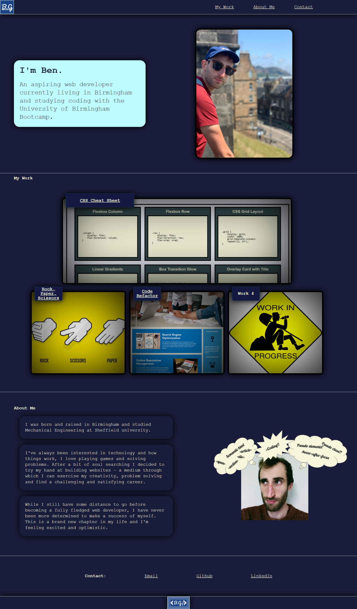

Ben Growcott's Portfolio page

This is my first portfolio page - it is a work in progress, but already contains
an introduction and photo of myself, sections and images of my work so and how to contact me.

- Navigation links at the top of the page scroll the UI to that section.

- Clicking on the title and images in the my work section links to websites I've deployed.

- My portfolio uses flex boxes and media queries to create a responsive layout that adapts to the viewport.

As I continue to improve my skills I will add more content to this website
and update the my work section.

Watch this space!

https://github.com/BGrowcott/bg_portfolio_page

https://bgrowcott.github.io/bg_portfolio_page/